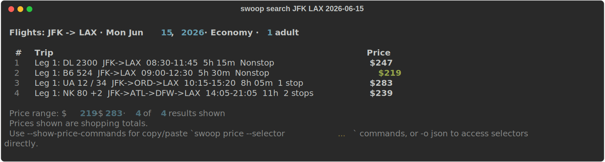
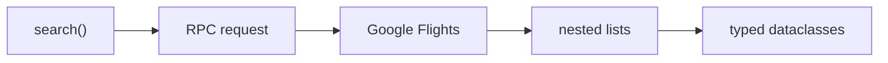

# swoop

[](https://pypi.org/project/swoop-flights/)
[](https://pypi.org/project/swoop-flights/)
[](https://github.com/saraswatayu/swoop/blob/main/LICENSE)
[](https://github.com/saraswatayu/swoop/actions/workflows/ci.yml)

Search Google Flights programmatically. Real prices, typed results, no API key.

```python
from swoop import search

results = search("JFK", "LAX", "2026-06-15")
for flight in results.best:
    airline = ", ".join(flight.airline_names)
    print(f"${flight.price} — {airline}")
```

> [!NOTE]
> Swoop is not affiliated with Google. It calls undocumented RPC endpoints that can change without notice.

Swoop calls Google Flights' internal `GetShoppingResults` and `GetBookingResults` RPC endpoints — the same ones the web app uses when you search for flights. Requests use TLS fingerprint impersonation via [primp](https://github.com/deedy5/primp) to match a real browser session. Responses are deeply nested lists (matching an internal protobuf schema) decoded into typed Python dataclasses.

[Perch](https://perchtravel.com) uses Swoop in production to monitor booked flights for price drops, saving users an average of $247 per trip.

---

## Install

```bash
pip install swoop-flights

# With CLI (adds `swoop` command)
pip install swoop-flights[cli]
```

## CLI

<p align="center">
  
</p>

```bash
# Search flights
swoop search JFK LAX 2026-06-15

# Nonstop, sorted by price
swoop search JFK LAX 2026-06-15 --nonstop --sort cheapest

# Roundtrip, business class
swoop search JFK LAX 2026-06-15 -r 2026-06-22 --cabin business

# JSON output for piping
swoop search JFK LAX 2026-06-15 -o json -q | jq '.results[0].price_usd'

# See fare tiers for search result #1
swoop book 1 JFK LAX 2026-06-15
```

<details>
<summary>More CLI examples</summary>

```bash
# Look up a specific flight
swoop flight DL2300 -f JFK -t LAX -d 2026-06-15

# CSV for spreadsheets
swoop search JFK LAX 2026-06-15 -o csv -q > flights.csv

# Filter by airline and time window
swoop search JFK LAX 2026-06-15 -a DL -a UA --depart-after 8 --depart-before 14
```

</details>

Run `swoop search --help` for all options.

## Python API

### One-way search

```python
from swoop import search

results = search("SFO", "JFK", "2026-06-15")

# results.best  — top-ranked flights
# results.other — remaining flights
for flight in results.best:
    print(f"${flight.price}")
    print(f"  {flight.departure_airport} → {flight.arrival_airport}")
    print(f"  {flight.airline_names}, {flight.stop_count} stops")
    print(f"  {flight.travel_time} min total")
```

<details>
<summary>More examples</summary>

### Roundtrip search

```python
results = search("SFO", "JFK", "2026-06-15", return_date="2026-06-22")
# Price in results is the roundtrip total
```

### Cabin class and filters

```python
from swoop import search, SORT_CHEAPEST

results = search(
    "LAX", "NRT", "2026-06-15",
    cabin="business",       # economy, premium-economy, business, first
    max_stops=0,            # nonstop only
    sort=SORT_CHEAPEST,     # cheapest first
    airlines=["NH", "JL"],  # filter to specific carriers
    earliest_departure=8,   # depart after 8am
    latest_departure=14,    # depart before 2pm
)
```

### Booking details (fare options)

```python
from swoop import search, get_booking_results

results = search("JFK", "LAX", "2026-06-15")
itinerary = results.best[0]

# Get fare tiers — just pass the itinerary
options = get_booking_results(itinerary)

for opt in options:
    print(f"${opt.price} — {opt.brand_label} ({opt.fare_family})")
```

</details>

> [!TIP]
> Google rate-limits aggressively. All RPC functions default to `retries=2` with exponential backoff and jitter. Increase to `retries=3` for extra resilience.

## How it works

Swoop reverse-engineers the `FlightsFrontendService` RPC interface that powers Google Flights. Search parameters are encoded as nested JSON arrays matching Google's internal protobuf schema, then sent as HTTP POST requests. The HTTP client uses TLS fingerprint impersonation (via [primp](https://github.com/deedy5/primp)) so requests are indistinguishable from a real Chrome session.

Responses arrive as deeply nested list structures — no field names, just positional indices. Swoop's decoder walks these structures and maps them to typed Python dataclasses (`Itinerary`, `Flight`, `Layover`, `CarbonEmissions`, etc.) with named attributes.



<details>
<summary>API reference</summary>

### `search(origin, destination, date, **kwargs)`

Search Google Flights and return a `SearchResult`.

| Parameter | Type | Default | Description |
|-----------|------|---------|-------------|
| `origin` | `str` | required | Origin IATA code |
| `destination` | `str` | required | Destination IATA code |
| `date` | `str` | required | Departure date (`YYYY-MM-DD`) |
| `return_date` | `str \| None` | `None` | Return date for roundtrip |
| `cabin` | `str` | `"economy"` | `economy`, `premium-economy`, `business`, `first` |
| `adults` | `int` | `1` | Number of adults |
| `max_stops` | `int \| None` | `None` | `None`=any, `0`=nonstop, `1`=1 stop, `2`=2 stops |
| `sort` | `int` | `SORT_DEPARTURE_TIME` | Sort order constant |
| `airlines` | `list[str] \| None` | `None` | Filter by airline codes |
| `include_basic_economy` | `bool` | `False` | Include basic economy fares (excluded by default so prices reflect Main Cabin) |
| `timeout` | `int` | `90` | HTTP timeout in seconds |
| `retries` | `int` | `2` | Retries on HTTP 429 with exponential backoff + jitter |

Returns `SearchResult | None`. `None` means no results found.

### `get_booking_results(itinerary_or_token, **kwargs)`

Get fare options for a specific itinerary. Pass an `Itinerary` object directly, or a booking token string with explicit `origin`, `destination`, `date`, and `selected_legs`. Returns `list[BookingOption]` with `price`, `brand_label`, `brand_code`, `fare_family`, etc. `BookingOption` supports both attribute access (`opt.price`) and dict-style access (`opt["price"]`, `opt.get("price")`).

### Result types

- **`SearchResult`** — `best: list[Itinerary]`, `other: list[Itinerary]`, `price_range: PriceRange | None`
- **`Itinerary`** — Full itinerary with `price`, `flights`, `layovers`, `travel_time`, `booking_token`, `carbon_emissions`
- **`Flight`** — Segment details: `airline`, `flight_number`, `aircraft`, `legroom`, `co2_grams`, `amenities`
- **`Layover`** — Stop info: `minutes`, airports, `is_overnight`
- **`CarbonEmissions`** — `this_flight_grams`, `typical_for_route_grams`, `difference_percent`

### Constants

| Constant | Value | Description |
|----------|-------|-------------|
| `SORT_TOP` | `1` | Google's default ranking |
| `SORT_CHEAPEST` | `2` | Cheapest first |
| `SORT_DEPARTURE_TIME` | `3` | By departure time |
| `SORT_ARRIVAL_TIME` | `4` | By arrival time |
| `SORT_DURATION` | `5` | Shortest first |

### Error handling

All exceptions inherit from `SwoopError`. Catch `SwoopRateLimitError` for HTTP 429, `SwoopHTTPError` for other HTTP failures, and `SwoopParseError` for response decoding issues.

</details>

## Contributing

Issues and pull requests welcome at [github.com/saraswatayu/swoop](https://github.com/saraswatayu/swoop/issues).

## License

MIT
